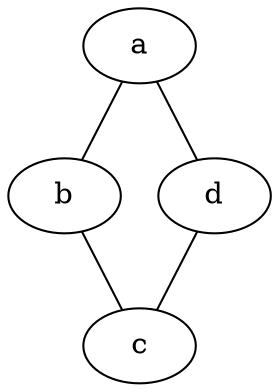

在学习生活中经常遇到需要绘制各种流程图，框图，UML图的情况，一种比较方便的方法就是使用**Graphviz**来进行绘制，而Graphviz使用Dot语言进行解析生成，故学习dot，并作此笔记

## dot语法总结

### dot的抽象语法

|    对象    |                      格式与内容                       |
| :--------: | :---------------------------------------------------: |
|   graph    | [ strict ] (graph\| digraph) [ ID ] '{' stmt_list '}' |
| stmt_list  |                 [stmt[';']stmt_list]                  |
|    stmt    |                       node_stmt                       |
|     \      |                       edge_stmt                       |
|     \      |                       attr_stmt                       |
|     \      |                      _ID_'='_ID_                      |
|     \      |                       subgraph                        |
| attr_stmt  |           (graph\| node \| edge ) attr_list           |
| attr_list  |           '[' [ a_list ] ']' [ attr_list ]            |
| edge_stmt  |      (node_id\| subgraph) edgeRHS [ attr_list ]       |
|  edgeRHS   |        edgeop (node_id\| subgraph) [ edgeRHS ]        |
| node_stmt  |                 node_id [ attr_list ]                 |
|  node_id   |                      ID [ port ]                      |
|    port    |               ':' ID [ ':' compass_pt ]               |
|     \      |                    ':' compass_pt                     |
|  subgraph  |         [ subgraph [ ID ] ] '{' stmt_list '}'         |
| compass_pt | (n\| ne \| e \| se \| s \| sw \| w \| nw \| c \| \_)  |

### 关键字

其中在有向图中使用`->`在无向图中使用`--`来表示边

- node：节点属性
- edge：连线属性
- graph：图属性，或声明一个无向图时使用
- digraph：有向图
- subgraph：声明子视图，名字要以`cluster`开头。
- strict：严格模式，用于防止相同的两个节点间使用重复的连线。




### 元素声明和定义及属性

#### 图(graph)

##### 声明和定义

使用(graph| digraph) graphName {}来声明和定义一个图。
使用subgraph cluster_subGrapgName {}来在图中声明子图

```
digraph example1 {
  label = "this is a graph";
  a;b;

  subgraph cluster_subgraphName1 {
    label = "this is a  subgraph";
    bgcolor = blue;
    c;d;
  }
}
```

##### 属性

1. bgcolor：设置图的背景颜色，可以使用rgb值，也可以用#rrggbb编码形式
2. label：设置图的描述。label会继承到子图，如果不想子图重复label需手动设置
3. rankdir：设置图的 方向，包括：TB（top to bottom）、BT（bottom to top）、LR(left to 4. Right）、RL（right to left）
4. rotate：设置图的旋转。如rotata = 90代表旋转90度，默认逆时针
5. ratio：设置图的长宽比，可以是一个浮点数，也可以是：fill、compress、auto
6. compounrd: 设置图内子图之间的边的连接，为布尔值

** 在子图间建立边 **
需要设置图的属性`compound=true`

#### 节点(node)

##### 声明与定义

声明一个节点只需要输入节点的名字，抽象语法如下

`nodeName [attr_list]`

若节点的名字特殊可以使用双引号将其括起来，如"x,y"

##### 属性

可以使用`node`关键字设定全局节点属性

1. shape：设置结点形状。包括：Mrecord（圆角矩形）、record（矩形）、circle（圆形）、box（矩形，和record略有区别，下面会讲到）、egg（蛋形）、doublecircle（双圆形）、plaintext（纯文本）、 ellipse（椭圆，默认）。更多详见[官方文档](https://graphviz.org/doc/info/shapes.html)
2. label：设置结点的显示内容，内容用双引号包含，可以使用转义字符。当结点内容!=结点名时使用
3. style：设置结点的样式。包括：filled(填充)、dotted（点状边框）、solid（普通边框）、dashed（虚线边框）、bold（边框加粗）、invis（隐形）。
4. color：设置边框颜色。可以使用单词形式或者#rrggbb形式。
5. fillcolor：设置填充颜色，仅style = filled时有效。
6. width：设置结点宽度。
7. height：设置结点高度。
8. perpheries：设置结点边框个数。
9. fontcolor：设置结点内容颜色。可以使用单词形式或者#rrggbb形式

**Label**

在label上record和box有所区别。原因就是：设置为record和Mrecord的结点的label属性可以很方便地生成单列的表格和UML图等。（类似于XAML里面的stack）

用一对双引号+一对花括号包含起来的就是表格内容，不同的格子之间用符号 | 隔开，尖括号里的内容表示一个锚点

例如：

```
example [shape = record, label = "{<head>cell1 | cell2 | cell3}"];
```

### 边

##### 声明和定义

边的声明比较简单，只需用`->`(digraph)或者`--`(graph)将2个节点置于两侧即可，对于未声明的节点会自动声明。抽象化声明：
`nodeName1 ->|-- nodeName2 [attr_list]`
如：`a->b `

##### 边的属性

1.style：设置边的形状。包括：solid（实线）、dashed（虚线）、dotted（点线）、bold（加粗）、invis（隐形）。
2.label：设置边标签。内容用双引号包含，可以使用转义字符。
3.color：设置边颜色。可以使用单词形式或者#rrggbb形式。
4.arrowhead：设置结点箭头样式。包括：none、empty、odiamond等详见[arrowhead样式表](https://graphviz.org/docs/attr-types/arrowType/)。
5.ltail或者lhead:：当compound设置为true时，边被裁剪到子图的边界处
6.headlabel/taillabel：边上靠近头部/尾部的标签

### 注释与表格锚点

使用`//`或者`/**/`来添加注释

对于表格锚点，在表格中尖括号里的为表格锚点名称示例：

```
digraph example2 {
  node [shape = record];
  table1 [label = "{<head>cell1 | cell2 | cell3}"];
  table2 [label = "{<head>cell1 | cell2}"];

  table1: head -> table2: head
}
```

## dot应用

### 支持中文

Graphviz默认是不支持中文的，输入的中文在生成的图中显示为一个空方块。如果想要让其支持中文，可以尝试以下方法：

- 在命令行制定-Nfontname = xxx.ttf，在gv文件中输入utf-8编码的汉字
- 给graph、node、edge设置fontname = xxx.ttf然后设置label

### 支持html

**labal**属性支持html语言。

### 绘制内容丰富的节点

主要使用label标签的特性

```
digraph structs {acyclic
    node [shape=record];
       struct1 [shape=record, label="<f0> left|<f1> mid\ndle|<f2> right"];
       struct2 [shape=record, label="<f0> one|<f1> two"];
       struct3 [shape=record, label="hello\nworld |{ b |{c|<here> d|e}| f}| g | h"];
       struct1 -> struct2;
       struct1 -> struct3;
}
```

### Graphviz的使用

命令行的抽象语法
`dot -[Tps|Tsvg|Tfig|Tpng|Tgif] -Nfontname = xxx.ttf -O outName`

可能的内容如下：

|  选项   |        用途        |
| :-----: | :----------------: |
|  -Tps   |   输出PostScript   |
|  -Tsvg  |      输出SVG       |
|  -Tfig  |      输出XFIG      |
|  -Tpng  |      输出PNG       |
|  -Tgif  |      输出GIF       |
| -G键=值 |   设置默认图属性   |
| -N键=值 |  设置默认结点属性  |
| -E键=值 |   设置默认边属性   |
|   -O    | 自动生成输出文件名 |
| -sf尺度 |   缩放输入默认72   |
|   -y    | 反转输入中的y坐标  |

## 参考文献

[^1]: [Graphviz官方文档](https://graphviz.org/documentation/)
[^2]: [dot语法总结 Code@浮生记](https://onlookerliu.github.io/2017/12/28/dot%E8%AF%AD%E6%B3%95%E6%80%BB%E7%BB%93/#2-%E5%9B%BE%E7%9A%84%E5%A3%B0%E6%98%8E)
